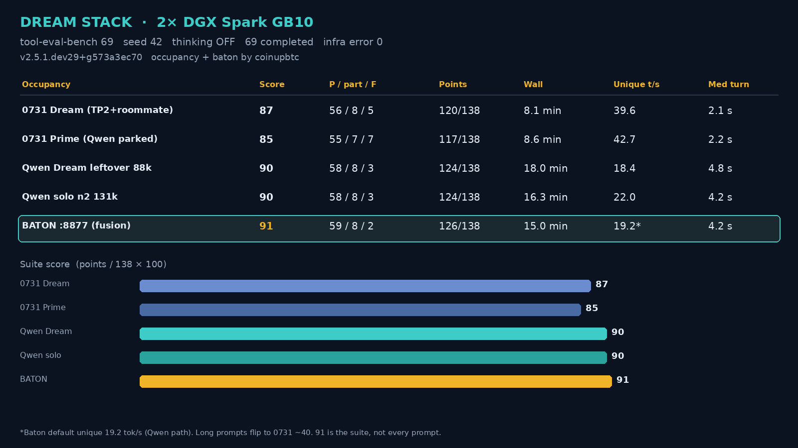

# Dream stack




Supporting occupancy for **two NVIDIA DGX Spark** boxes (GB10, CX7) after 0731 TP=2 is already up. Not the public hero — that is [miaai35-tune](https://github.com/Coinupbtc/miaai35-tune).

**Credit — TP=2 / dual-node serving:** [MiaAI-Lab / Anemll DeepSeek-V4-Flash DSpark TP=2](https://github.com/MiaAI-Lab/DeepSeek-v4-Flash-DSpark-2x-DGX-Spark) is the recipe that runs 0731 across both Sparks. This repo adds leftover-UMA occupancy (Qwen GGUF roommate + baton) on that pair.

## At a glance

| | |
|---|---|
| **What it is** | Supporting occupancy: keep MiaAI 0731 TP2 as the chat brain, room a Qwen 3.8 GGUF on leftover UMA, talk to **one URL** (`dream-baton` `:8877`). |
| **What it’s for** | Spark owners who already run the MiaAI TP=2 pair and want leftover-UMA occupancy, not a hire-lead or Spark flagship. Laptop clones still get the scores, flags, and a no-GPU `./setup.sh`. |
| **How to use it** | `./setup.sh` (orients). Two Sparks + 0731 already at 348k / 0.74: edit `.env`, then `./setup.sh --up`. |

**GitHub description:** What: supporting occupancy on MiaAI 0731 TP2 — leftover Qwen + baton (hero is miaai35-tune). For: clone, copy `.env`, bring the stack up. How: `./setup.sh` then `./setup.sh --up`.

This is **not** a new engine. You already run the public [MiaAI / Anemll DeepSeek-V4-Flash-0731 DSpark TP=2](https://github.com/MiaAI-Lab/DeepSeek-v4-Flash-DSpark-2x-DGX-Spark) pair. Dream keeps that chat brain and rooms two more services in leftover UMA:

| Piece | Where | URL | Window (live) |
|---|---|---|---|
| **DeepSeek-V4-Flash-0731** TP=2 | both Sparks | `http://127.0.0.1:8888/v1` | **347392** |
| **Qwen3.8-27B** Unsloth UD-Q4_K_XL + **mmproj** + **MTP4** + ngram | **node2 only** | `http://$N2_IP:8100/v1` | **116224** engine. Client prompt budget **~95k** if you also want 20k out (in+out share the slot). Native VL. |
| **Qwen3-VL-4B sidecar** | **gone in Dream** | — | Prime-only. Dream eyes = the 27B roommate. |
| **Baton** (this repo) | head node | `http://127.0.0.1:8877/v1` | advertises **347392** |

NVFP4 Qwen **does not fit** next to 0731 TP2. The roommate has to be the GGUF. This is **not** “one model per Spark.” 0731 still owns both UMAs.

Measured 2026-08-16 on this occupancy ([tool-eval-bench](https://github.com/SeraphimSerapis/tool-eval-bench) suite of 69, seed 42, thinking off). All 69 scenarios **completed** (0 infra errors). That is run completion, not a 69/69 pass score. Numbers below are the harness `score` and pass / partial / fail. CI in this repo is syntax + `./setup.sh` only — it does not run teb. Reproduce with `bash scripts/run-teb.sh 69 baton` (and `0731` / `qwen`):

| Brain | Score | Pass / partial / fail | Wall |
|---|---:|---|---:|
| 0731 Dream | 87 | 56 / 8 / 5 | 8.1 min |
| Qwen Dream | 90 | 58 / 8 / 3 | 18.0 min |
| **Baton** (`dream-baton`) | **94** | **61 / 8 / 0** | 13.9 min |

Parking the roommate does **not** raise 0731’s tool score (Prime 85). Giving Qwen the whole node does **not** raise Qwen’s score (solo 90). Full numbers: [RESULTS.md](RESULTS.md).

---

## Try it

### One command (any machine — no GPU)

```bash
git clone https://github.com/Coinupbtc/dream-stack.git
cd dream-stack && ./setup.sh
```

Writes `.env` from `env.example`, syntax-checks scripts, prints next steps.

### Two Sparks (0731 already on `:8888` at 348k / 0.74)

```bash
git clone https://github.com/Coinupbtc/dream-stack.git
cd dream-stack
./setup.sh
# edit .env — at least N2_IP, SPARK2, GGUF, LLAMA_SERVER
./setup.sh --up
```

`up.sh` checks 0731, starts Qwen on node2 with the **exact live flags**, starts baton on `:8877`, then smokes both brains.

Talk to one URL:

```bash
curl -s http://127.0.0.1:8877/v1/models
# model id: dream-baton   max_model_len: 347392

curl -s http://127.0.0.1:8877/v1/chat/completions \
  -H 'Content-Type: application/json' \
  -d '{"model":"dream-baton","messages":[{"role":"user","content":"Say hi in 6 words."}]}'
```

Point any OpenAI-compatible client at `http://127.0.0.1:8877/v1` · model `dream-baton`. No Kanban tags.

Optional always-on:

```bash
bash scripts/install-systemd.sh   # user unit, paths from this clone
```

---

## Prerequisites

Hardware: 2× DGX Spark, CX7 (~0.4 ms), passwordless SSH from node1 → `spark2`.

### 1. 0731 TP2 (not in this repo)

Use Mia’s recipe. Dream knobs that match this occupancy:

```bash
# in the DSpark repo, on the head node
export MAX_MODEL_LEN=347392
export GPU_MEMORY_UTILIZATION_TEXT=0.74
export ENABLE_VL_SIDECAR=0
./start-deepseek-v4-flash-dspark.sh
```

Confirm:

```bash
curl -s http://127.0.0.1:8888/v1/models
# id: deepseek-v4-flash-0731
# max_model_len: 347392
```

Do **not** leave 0731 at 524k / 0.75 if you want the Qwen roommate. That pair ate the leftover.

### 2. Qwen GGUF + llama-server (on node2)

~16.7 GiB Unsloth file, same path on both nodes (rsync after download):

```bash
bash scripts/fetch-gguf.sh
# default: ~/models/hf/Qwen3.8-27B/Qwen3.8-27B-UD-Q4_K_XL.gguf
# from unsloth/Qwen3.8-27B-GGUF
```

`llama-server` must speak Qwen 3.8 (`arch=qwen35`) and `--spec-type draft-mtp`. This box uses `~/llama.cpp-v9/build/bin/llama-server`.

### 3. Node2 leftover RAM

0731 TP2 already holds both UMAs. Node2 only has leftover for the GGUF. If `free -g` on spark2 is brutal, do not start a second 0731 rank or NVFP4 Qwen.

Vision 4B on **node1** is the live trio. Text benches (tool-eval-bench) do not need it.

---

## Exact live flags (do not “improve” these)

Roommate (`scripts/start-roommate.sh`):

```text
llama-server
  --model    Qwen3.8-27B-UD-Q4_K_XL.gguf
  --ctx-size 116000         # llama.cpp aligns to 116224
  --parallel 1
  --flash-attn on
  --cache-type-k q4_0
  --cache-type-v q4_0
  --batch-size 4096
  --ubatch-size 1024
  --host 0.0.0.0 --port 8100
  --alias Qwen3.8-27B
  --chat-template-kwargs {"enable_thinking":false,"preserve_thinking":true}
  --spec-type draft-mtp,ngram-mod,ngram-simple
  --spec-draft-n-max 4
  --spec-draft-p-min 0.4
```

Baton (`dream-baton.py` on `:8877`):

| Request | Brain |
|---|---|
| default | Qwen |
| `tool_choice=required` or `any` | 0731 |
| estimated prompt > **100000** tokens | 0731 (Qwen’s 124k would overflow) |
| async / poll / run-script | 0731 |
| find-then-email | 0731 |

Clients see `max_model_len=347392`. Thinking is forced **off** so tool-eval-bench matches the published scores.

Fat Qwen prefills (est ≥ 24k) and 0731 calls **take turns on node2** (`BATON_N2_FAT` / `BATON_N2_WAIT`). Short Qwen chats skip the lock. 124k ctx OOM-killed n2; do not raise past 116k without leftover ≥4 G.

Laws:

1. Qwen is `http://<node2>:8100` — never `127.0.0.1:8100` on node1.
2. Do not start NVFP4 Qwen beside 0731 TP2.
3. Do not idle-park node1 vision if you run the pictures sidecar.
4. Do not bounce 0731 to “heal” Qwen.

---

## Validate (what an expert should run)

```bash
bash scripts/status.sh
bash scripts/smoke.sh
```

Expect:

```text
UP   0731   max_model_len=347392
UP   Qwen   n_ctx=116224
UP   baton  max_model_len=347392  id=dream-baton
```

Re-run the public tool bench (same instrument as the Qwen 3.8 posts):

```bash
# short smoke (15)
bash scripts/run-teb.sh --short baton

# full 69, seed 42 — this is the published table
bash scripts/run-teb.sh 69 baton
bash scripts/run-teb.sh 69 0731
bash scripts/run-teb.sh 69 qwen
```

Compare to [RESULTS.md](RESULTS.md). Same seed, same thinking-off kwargs, or the score is not comparable.

---

## Repo map

```text
dream-baton.py              one-URL router
env.example                 copy to .env
scripts/up.sh               0731 check + roommate + baton + smoke
scripts/start-roommate.sh   exact live GGUF flags over ssh spark2
scripts/start-baton.sh      foreground, or BATON_DAEMON=1
scripts/status.sh           curl all pieces
scripts/smoke.sh            2-token chat on 0731, Qwen, baton
scripts/fetch-gguf.sh       huggingface download + optional rsync
scripts/run-teb.sh          tool-eval-bench wrapper
scripts/install-systemd.sh  user unit with this clone’s paths
systemd/dream-baton.service template
RESULTS.md                  measured 69s
tweet-cards/                scoreboard + A/B cards
```

House-only A/B (parks engines on **this** cluster): `run-prime-then-solo-qwen-69.sh`. Do not run that on someone else’s box unless they asked.

---

## Credit

- 0731 TP2 engine: [MiaAI-Lab / Anemll DSpark](https://github.com/MiaAI-Lab/DeepSeek-v4-Flash-DSpark-2x-DGX-Spark)
- Qwen 3.8 weights: [Qwen](https://huggingface.co/Qwen) / [Unsloth GGUF](https://huggingface.co/unsloth/Qwen3.8-27B-GGUF)
- Public tool-call eval: [tool-eval-bench](https://github.com/SeraphimSerapis/tool-eval-bench) (`v2.5.1.dev29+g573a3ec70` for the numbers in RESULTS.md)
- Occupancy notes, roommate flags, vision pin, and baton: this repo (supporting; public hero is [miaai35-tune](https://github.com/Coinupbtc/miaai35-tune))
